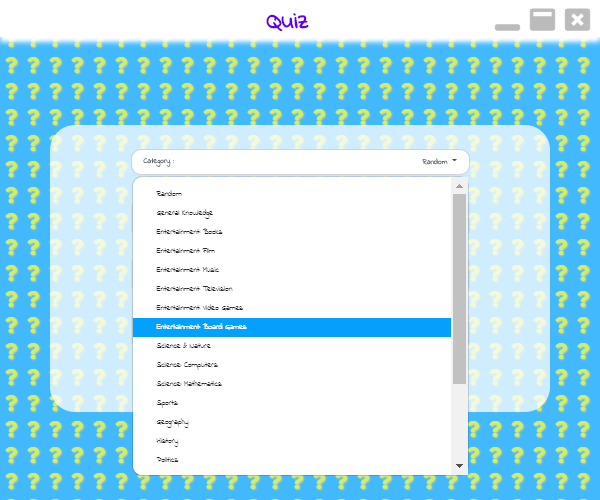

# Quiz

# Summary
Multiple choice quiz general knowledge quiz game. Beat the clock to set a high score.
Lots of categories to choose from.
# Getting Started
There are two ways you can get the application.
* Download the application from the [windows store.](https://www.microsoft.com/store/apps/9NJNHSSL77KH)
* Download the application from the release section, unzip and run the Quiz.exe
* Download the project source code and build it yourself. Run npm package-app-64 in your console for a x64 build.

# Versions
## V1.3.1

* Multiple choice quiz
* Category selection
* General knowledge
* Store high scores
* Restart game

